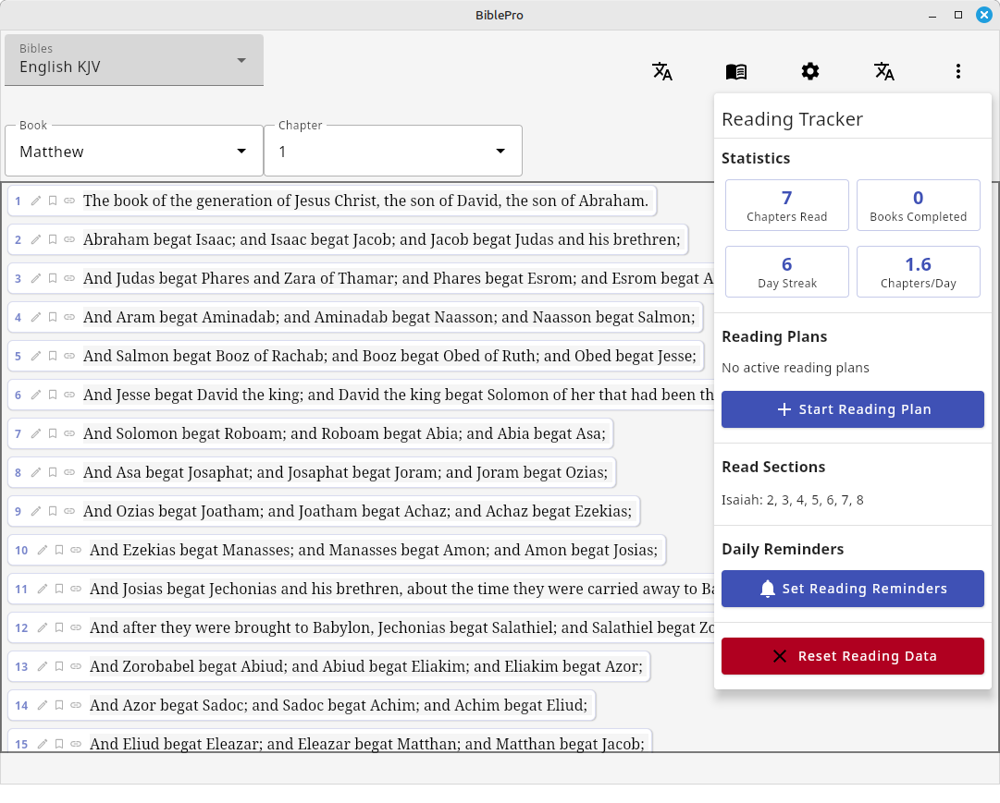

# BiblePro

Cross-platform Bible app written in Kotlin Multiplatform Compose

> **Disclaimer**: All localization and Bible translation selection in this application has been done by AI and may not be perfect. Please verify translations and language support for accuracy in your specific use case.

MSI, DEB, and RPM packages are available on the [releases page](releases).

## Platforms Supported
- **Desktop**: Windows, macOS, Linux (via Compose Multiplatform)
- **Android**: APK builds available

## Quick Start

### Desktop
```bash
# Build and run
./gradlew run

# Create distribution package
./gradlew packageDistributionForCurrentOS
```

### Android
```bash
# Build debug APK
./gradlew assembleDebug

# Build release APK
./gradlew assembleRelease
```

## Features

### Bible Reading
- Read the Bible in multiple translations side-by-side
- Navigate easily through books and chapters
- Verse highlighting and display customization
- Support for multiple Bible panes for comparative study

### Bible Translations
- King James Version (KJV)
- Young's Literal Translation (YLT)
- Amplified Bible
- Spanish Reina Valera 2020
- Greek Textus Receptus
- And 25+ additional translations in multiple languages

### Strong's Concordance Integration
- Built-in Strong's concordance for original language study
- Click on words in original languages to see Strong's numbers and definitions
- Detailed lexicon data for deeper word study

### Search Functionality
- Lightning fast search across all your Bible translations
- Search results displayed with context
- Open multiple search panes simultaneously

### Reading Tracking and Plans
- Track which sections of the Bible have been read
- Reading statistics (chapters read, books completed, day streak, average chapters per day)
- Reading plans including:
  - Bible in a Year
  - New Testament in 90 Days
- Progress tracking for reading plans
- Daily reading assignments

### Cross-References
- Inline English cross-references
- Easy navigation between related passages

### Notes System
- Global notes functionality
- Take and organize notes on Bible passages

### UI Features
- Dark mode support with theme toggle
- Multiple panes for simultaneous viewing of different content
- Responsive design for different screen sizes

### Offline Functionality
- All data stored locally on your device
- No internet connection required, even for downloading Bibles

### Localization
- Multi-language support with easy language switching
- Bible book names translated for supported languages
- **Supported Languages**: English, Arabic, Bengali, Chinese, French, German, Hindi, Italian, Japanese, Javanese, Korean, Marathi, Portuguese, Russian, Spanish, Tamil, Telugu, Turkish, Urdu, Vietnamese, Indonesian, Swahili, Dutch, Polish, Romanian, Greek, Hebrew, Tagalog, Amharic, Thai, Cebuano, Hausa, Yoruba, Norwegian, Swedish, Danish, Czech, Hungarian, Croatian, Serbian
- Extensible localization system for adding new languages

## Technical Details

### Architecture
- **MVVM Pattern**: Clean separation of concerns with ViewModels handling business logic
- **Kotlin Multiplatform**: Shared codebase between desktop and Android
- **Compose Multiplatform**: Modern declarative UI framework
- **StateFlow**: Reactive state management
- **Multi-pane System**: Dynamic pane management for comparative study

### Data Storage
- Bible translations stored as XML files in application resources
- Lazy loading and caching for optimal performance
- Strong's concordance data integrated for original language study
- Platform-specific storage implementations for notes and settings

### Development
- Built with Gradle and Kotlin Multiplatform
- Structured for easy addition of new Bible translations
- Comprehensive localization system for international support
- See `CLAUDE.md` for detailed development guidelines

Screenshot:


License:  MIT License

Copyright 2025 Edwin Zimmermman

License for all chain reference data:  [ CC BY-NC-SA 4.0 ](https://creativecommons.org/licenses/by-nc-sa/4.0/?ref=chooser-v1)
